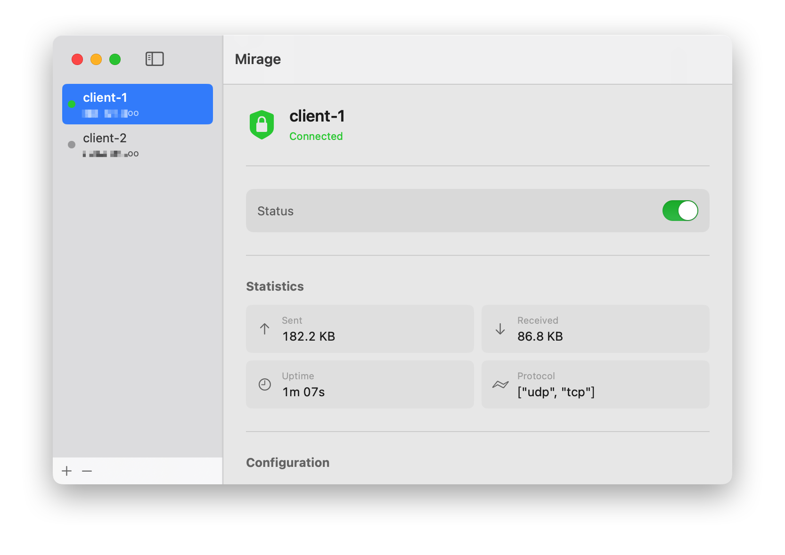

# Mirage (原本的 Quincy)

[](https://crates.io/crates/mirage)
[](https://hub.docker.com/r/m0dex/mirage)
[](https://docs.rs/mirage/)
[](https://github.com/M0dEx/mirage/actions?query=workflow%3ACI)
[](LICENCE)

> [!WARNING]
> **🚧 项目开发中 (Work in Progress) 🚧**
>
> Mirage 目前处于 **Phase 1 (TCP/TLS 基础隧道)** 开发阶段。虽然代码可以通过编译 (`cargo build --release`)，但可能仍不稳定。
> 详情请查阅 [Mirage 可行性分析](./mirage_feasibility_analysis.md)。

> **Mirage** 是一款基于 Rust 开发的下一代 VPN 客户端和服务端，旨在提供极致的隐蔽性和性能。
> 它从原本的 QUIC 架构迁移到了 **TCP/TLS**，集成 **BoringSSL** 以完美模拟 Chrome 指纹，并采用 **Reality** 协议思想进行主动伪装。



---

## 核心特性 (Features)

基于最新的[可行性分析](./mirage_feasibility_analysis.md)，Mirage 具备以下独有优势：

### 1. 完美的 TLS 指纹伪装 🎭
Mirage 放弃了传统的 OpenSSL/Rustls 模拟方案，直接集成 Google Chrome 同源的 **BoringSSL** 库。
- ✅ **原生 Chrome 指纹**：支持 X25519Kyber768 (后量子加密)、GREASE 扩展、TLS 扩展随机排列。
- ✅ **抗主动探测**：服务端无法通过 TLS 握手特征识别，完美伪装成正常的 HTTPS 流量。

### 2. Reality 协议集成 🌐
服务端不再仅仅是一个 VPN 端点，而是一个智能的 SNI 反向代理：
- **验证通过**：进入 VPN 隧道模式，高速传输数据。
- **验证失败**：无缝转发到真实的目标网站（如 www.microsoft.com），探测者只能看到合法的网站内容。

### 3. 高性能 TCP 传输 🚀
- 采用 Length-Prefixed 帧协议，解决 TCP 粘包问题。
- 设计为未来支持 **XTLS-Vision** 流控，旨在消除 TLS-in-TLS 双重加密开销，实现原生 HTTPS 级别的性能。

---

## 架构对比 (Mirage vs Quincy)

| 特性 | Quincy (旧版) | Mirage (新版) |
|------|---------------|---------------|
| **传输层** | QUIC (UDP) | TCP/TLS (1.3) |
| **TLS 库** | Rustls | BoringSSL (Chrome 同源) |
| **伪装能力** | 弱 (仅标准 TLS) | 强 (Reality + Chrome 指纹) |
| **抗探测** | 易受 UDP QoS 限制 | 伪装为 HTTPS，通用性更强 |

---

## 快速开始 (Quick Start)

### 支持平台
- [x] Windows (x86_64) - 使用 Wintun
- [x] Linux (x86_64, aarch64)
- [x] macOS (aarch64)

### 编译安装

Mirage 依赖 Rust 工具链和 C 编译器（用于构建 BoringSSL）。

```bash
# 编译所有组件
cargo build --release

# 安装二进制文件
cargo install --path mirage-client
cargo install --path mirage-server
cargo install --path mirage-gui
```

### 使用 Docker 运行

```bash
# 服务端运行示例
docker run --rm \
  --cap-add=NET_ADMIN \
  --device=/dev/net/tun \
  -p 443:443 \
  -v $(pwd)/config:/etc/mirage \
  m0dex/mirage:latest \
  mirage-server --config-path /etc/mirage/server.toml
```

---

## 配置指南 (Configuration)

### 客户端 (`client.toml`)

```toml
connection_string = "your-server.com:443"

[reality]
# 伪装的目标域名，必须与服务端一致
target_sni = "www.microsoft.com"

[authentication]
username = "myuser"
password = "mypassword"
```

### 服务端 (`server.toml`)

```toml
bind_address = "0.0.0.0"
bind_port = 443
tunnel_network = "10.0.0.1/24"

[reality]
# 伪装目标，非 VPN 流量将被转发到此地址
target_sni = "www.microsoft.com"

[connection]
reuse_socket = true
```

更多示例请参考 [`examples/`](examples/) 目录。

---

## 附录：Feasibility Analysis (可行性分析)

详情请参阅项目中的 [mirage_feasibility_analysis.md](./mirage_feasibility_analysis.md) 文档，其中详细阐述了从 QUIC 迁移到 TCP/TLS 的技术决策过程和路线图。

### 开发路线图 (Roadmap)
- [x] **Phase 1**: 基础 TCP/TLS 隧道开发 (当前阶段)
- [ ] **Phase 2**: Reality 服务端逻辑与转发
- [ ] **Phase 3**: Chrome 指纹深度集成
- [ ] **Phase 4**: XTLS-Vision 流控优化

---

## 许可证

Mirage 使用 AGPL-3.0 许可证。
