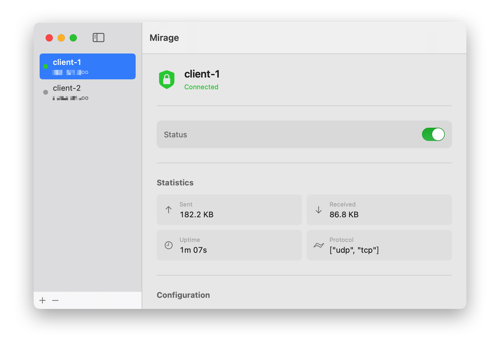

# Mirage（开发测试中）

[](https://crates.io/crates/mirage)
[](https://docs.rs/mirage/)
[](LICENCE)

> **Mirage** 是一款基于 Rust 开发的下一代隐匿 L3 VPN，集成 **BoringSSL** (Chrome 同源)、**Mirage 伪装协议** (TCP SNI 伪装 + 抗主动探测)、**JLS** (QUIC 层伪装 + 0-RTT)，以及智能流量混淆。



---

## 核心特性

### 🛡️ 完美的 TLS 指纹伪装
集成 Google Chrome 同源的 **BoringSSL**，原生支持 X25519Kyber768 (后量子)、GREASE、TLS 扩展随机排列。
任何检测者看到的都是标准 Chrome HTTPS 流量。

### 🎭 Mirage 伪装协议
TCP 和 QUIC 双协议均具备完整伪装能力，探测者只能看到合法流量：
- **TCP 层**: BoringSSL (Chrome 指纹) + SNI 伪装 + ShortID 认证，验证失败反向代理到真实网站
- **QUIC 层**: JLS 伪装 (rustls-jls) + 0-RTT 超低延迟，未认证连接自动转发到上游真实网站
- 无需目标网站证书即可伪装任意域名，抗主动探测

### 🚀 高性能双协议传输
- **TCP 模式**: Length-Prefixed 帧协议 + BBR 拥塞控制 + TCP_QUICKACK + Smart Batching
- **QUIC 模式**: JLS 伪装 + 0-RTT 快速握手 + 端口跳跃 (Port Hopping)
- **协议优先级回退**: `protocols = ["udp", "tcp"]`，先尝试 QUIC，失败自动回退 TCP

### 🌊 流量混淆与纵深加密
- **应用层加密 (Inner Encryption)**: ChaCha20-Poly1305 AEAD 独立加密 DATA 帧，即使外层 TLS 被 CDN 剥离，内层数据仍为密文
- **TLS 记录填充**: 将写入填充到 16KB TLS Record 边界，对抗记录大小指纹
- **加权拟态轮廓 (Weighted Traffic Mimicry)**: 模拟真实 HTTPS 的三态分布
- **双向填充对称 (Bidirectional Padding)**: 检测非对称传输并自动增强填充
- **智能时序抖动 (Jitter)**: 随机化发包间隔，对抗时序关联分析
- **应用层心跳 (Heartbeat)**: 空闲时自动保活，防止"长连接零吞吐"特征

### 🌐 全双工双栈聚合
- IPv4/IPv6 并发聚合带宽
- 多连接池 (1-4 并行连接)
- 连接轮换 (max_lifetime) 对抗长连接指纹

---

## 架构对比

| 特性 | Mirage | Xray (Reality) | NaiveProxy | AnyTLS | OpenVPN |
|------|--------|----------------|------------|--------|---------|
| **传输层** | TCP/TLS + QUIC + 优先级回退 | TCP/TLS, QUIC, WS, gRPC | Chromium HTTP/2 | 自定义 TLS | TCP/UDP (自定义) |
| **TLS 库** | **BoringSSL** (Chrome 同源) | uTLS (Go 模拟) | Chromium (原生) | OpenSSL | OpenSSL |
| **TCP 伪装** | **类 Reality** (SNI + 抗主动探测) | Reality | Chromium 原生 | 自定义握手 | 无 (特征明显) |
| **QUIC 伪装** | **JLS** (无需证书 + 0-RTT) | 无 | 无 | 无 | 无 |
| **VPN 层级** | **L3 VPN** (原生 ICMP/TCP/UDP) | L4 代理 (SOCKS/HTTP) | L4 代理 | L4 代理 | L3 VPN |
| **流量混淆** | Padding + Jitter + Heartbeat + **Inner Encryption** | Vision 流控 | 无 | 无 | 无 (需插件) |
| **CDN 支持** | ⏳ 计划中 | ✅ (WS/gRPC) | ✅ (需要证书) | ✅ | 无 |

---

## 安全分析

### 🔬 CCS 阈值攻击免疫

[Sukka 的研究](https://blog.skk.moe/post/ssr-reality-correct-critique/) 揭示了 Xray Reality 的核心漏洞：Go 标准库 TLS 的 CCS (Change Cipher Spec) 阈值为 **16**，而大多数 Web 服务器 (OpenSSL/BoringSSL) 为 **32**。审查者通过重放 ClientHello 可以检测到这一差异。

Mirage 使用 **BoringSSL** (阈值 32)，全链路都是同一个 TLS 栈，此探测手段**完全失效**。

### 🧬 TLS 指纹原生真实

BoringSSL 是 Chrome 的底层 TLS 库。Mirage 不是"模拟" Chrome 指纹 (uTLS 的做法)，**就是 Chrome 的 TLS 栈本身**。任何 JA3/JA4 指纹检测都无法区分 Mirage 与真实 Chrome 流量。

### 🛡️ 纵深防御体系

| 防御层 | 技术 | 对抗目标 |
|--------|------|----------|
| 应用层加密 | ChaCha20-Poly1305 AEAD | 外层 TLS 被 CDN 剥离后仍保持加密 |
| TLS 记录填充 | 填充到 16KB Record 边界 | 记录大小指纹识别 |
| 加权拟态轮廓 | 三态分布 (60% 小包 / 30% 中包 / 10% 大包) | 包长度分析 |
| 双向填充对称 | 检测非对称传输并自动增强 | 传输方向指纹 |
| 智能时序抖动 | 自适应 Jitter (空闲放大 / 高流量缩小) | 时序关联分析 |
| 应用层心跳 | 空闲自动保活 | 长连接零吞吐检测 |
| 连接轮换 | max_lifetime + jitter | 长连接指纹 |
| ALPN ShortID | 通过 ALPN 扩展携带认证令牌 | 比 Session ID 方式更隐蔽 |

### 📊 与 Xray Reality 深度对比

| 维度 | Xray REALITY | Mirage |
|---|---|---|
| CCS 阈值攻击 | ❌ **致命** (Go TLS 16 vs 源网站 32) | ✅ **免疫** (BoringSSL 32 全链路) |
| 回落对比攻击 | ❌ 两种 TLS 栈行为差异 | ✅ 同系 TLS 栈，无差异 |
| TLS 指纹 | ⚠️ uTLS 模拟 (可能存在细微差异) | ✅ BoringSSL 原生 (与 Chrome 完全一致) |
| QUIC 伪装 | ❌ 无 | ✅ JLS + 0-RTT + Port Hopping |
| 流量混淆 | ⚠️ Vision 流控 (单一) | ✅ 多层纵深 (Padding + Jitter + Inner Encryption) |
| 被动识别 (域名/IP 不匹配) | ⚠️ 通用风险 | ⚠️ 同等风险 |
| 被动识别 (多源单聚) | ⚠️ 通用风险 | ⚠️ 同等风险 |

> **总结**: Mirage 在伪装程度上属于开源方案中的**顶级水平**——消除了 CCS 阈值漏洞 (vs Reality)、比 NaiveProxy 更灵活 (无需证书、支持 QUIC 伪装)、防御纵深比 AnyTLS 更完善 (内加密 + 记录填充 + 拟态轮廓)。

> [!NOTE]
> 详细的安全分析和检测手段/对策矩阵请参阅 [SECURITY_ANALYSIS.md](SECURITY_ANALYSIS.md)。

## 快速开始

### 支持平台

| 平台 | 架构 | 方式 |
|------|------|------|
| Windows | x86_64 | CLI (Wintun) |
| Linux | x86_64, aarch64 | CLI |
| macOS | aarch64, x86_64 | **原生 SwiftUI GUI** + CLI |
| iOS / iPadOS | aarch64 | **原生 SwiftUI GUI** (Network Extension) |
| FreeBSD | x86_64, aarch64 | CLI |

### 编译安装

**CLI (命令行)**:

```bash
cargo build --release
cargo install --path mirage
```

**macOS / iOS GUI**:

```bash
# 一键编译所有 Apple 平台 Rust FFI 库
zsh resources/scripts/build-apple.sh

# 用 Xcode 打开并构建
open apple/Mirage/Mirage.xcodeproj
# ⌘⇧K (Clean Build Folder) → ⌘R (Run)
```

### 使用

```bash
mirage client --config client.toml   # 运行客户端
mirage server --config server.toml   # 运行服务端
mirage users --add users             # 管理用户
```

### Docker

```bash
docker run --rm \
  --cap-add=NET_ADMIN --device=/dev/net/tun \
  -p 443:443 -v $(pwd)/config:/etc/mirage \
  m0dex/mirage:latest \
  mirage server --config /etc/mirage/server.toml
```

---

## 配置指南

> [!TIP]
> **全局路由**: 建议使用 `0.0.0.0/1` + `128.0.0.0/1` 拆分路由，利用最长前缀匹配原则稳定接管流量。

示例请参考 [`examples/`](examples/) 目录。

---

## 网络配置 (服务端)

使用 `post_up` / `post_down` 生命周期脚本配置网络，与 WireGuard 的 PostUp/PostDown 用法一致。
`%i` 会自动替换为 TUN 接口名（如 `mirage0` 或 `interface_name` 指定的名称）。

```toml
# 指定 TUN 接口名（可选）
interface_name = "mirage0"

post_up = [
    "sysctl -w net.ipv4.ip_forward=1",
    "iptables -A FORWARD -i %i -j ACCEPT",
    "iptables -A FORWARD -o %i -j ACCEPT",
    "iptables -t nat -A POSTROUTING -s 10.0.0.0/24 -o eth0 -j MASQUERADE",
]
post_down = [
    "iptables -D FORWARD -i %i -j ACCEPT",
    "iptables -D FORWARD -o %i -j ACCEPT",
    "iptables -t nat -D POSTROUTING -s 10.0.0.0/24 -o eth0 -j MASQUERADE",
]
```

> [!TIP]
> 如需 IPv6，添加对应的 `ip6tables` 和 `sysctl -w net.ipv6.conf.all.forwarding=1` 命令即可。
> 不配置 `post_up` / `post_down` 则不进行任何自动网络配置。

---

## 用户管理

使用 `Argon2` 加密存储密码：

```bash
mirage users --add /path/to/users      # 添加用户（users 为用户文件路径，默认 ./users）
mirage users --delete /path/to/users   # 删除用户
```

---

## 路线图

- [x] **Phase 1**: TCP/TLS 隧道
- [x] **Phase 2**: Mirage 伪装协议 (TCP 层 SNI 伪装 + 抗主动探测)
- [x] **Phase 3**: 流量混淆 (Padding, Jitter, Heartbeat)
- [x] **Phase 4**: QUIC 传输 (h3 伪装, 0-RTT, Port Hopping)
- [x] **Phase 5**: 双栈聚合 + 连接轮换
- [x] **Phase 6**: **JLS 集成** — QUIC 层 Mirage 伪装 (无需证书, 0-RTT, 抗主动探测)
- [x] **Phase 7**: **Apple 原生 GUI** — SwiftUI (macOS + iOS/iPadOS) + Network Extension
- [x] **Phase 7.5**: **纵深加密** — 应用层 ChaCha20-Poly1305 AEAD + TLS 记录填充 + 双向填充对称
- [ ] **Phase 8**: CDN 支持 (WebSocket, gRPC)

---

## 许可证

Mirage 使用 AGPL-3.0 许可证。
