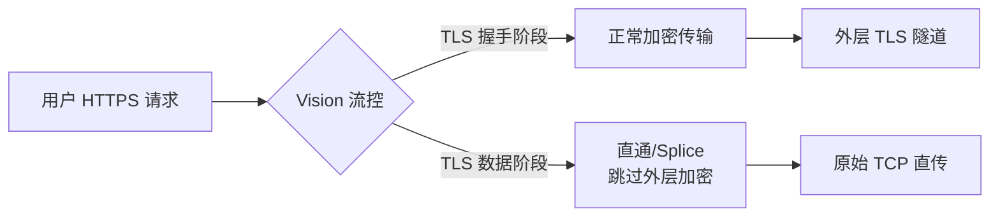
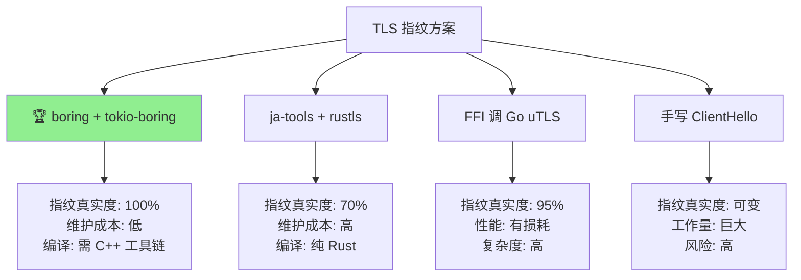
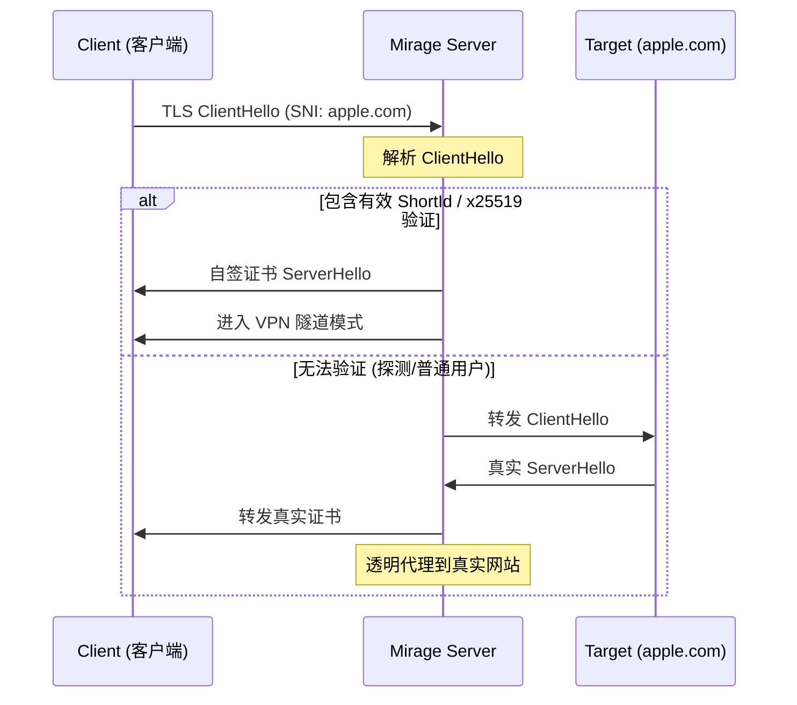
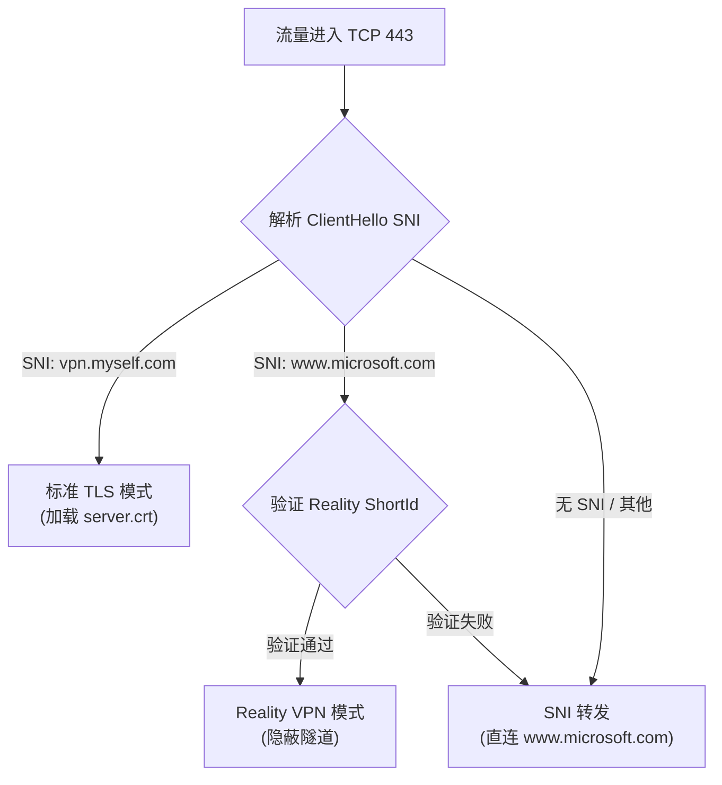
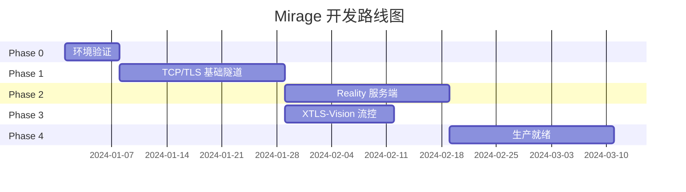

# Mirage 可行性分析

> 基于 Rust 的 TCP/TLS VPN + Reality 伪装协议

## 一、项目命名

**Mirage (幻影/海市蜃楼)** 是一个极佳的命名选择：

| 对比 | Quincy (原项目) | Mirage (新项目) |
|------|-----------------|-----------------|
| 含义 | 人名，无特殊意义 | "幻影"，完美契合伪装概念 |
| 发音 | /ˈkwɪnsi/ | /mɪˈrɑːʒ/ 简洁易记 |
| 品牌 | 普通 | Reality = 现实 → Mirage = 幻象，形成对偶反差 |

**建议**：采用 `Mirage` 作为项目名称。

---

## 二、技术可行性评估

### 2.1 可复用的 Quincy 基础设施 ✅

通过代码分析，`quincy` 提供了优秀的 Rust VPN 基础：

| 模块 | 文件路径 | 复用价值 |
|------|----------|----------|
| TUN 接口 | `quincy/src/network/interface/tun_rs.rs` | ⭐⭐⭐⭐⭐ 完全复用 |
| IP 包处理 | `quincy/src/network/packet.rs` | ⭐⭐⭐⭐⭐ 完全复用 |
| 路由管理 | `quincy/src/network/route/*.rs` | ⭐⭐⭐⭐⭐ 完全复用 |
| DNS 配置 | `quincy/src/network/dns/*.rs` | ⭐⭐⭐⭐⭐ 完全复用 |
| 认证框架 | `quincy/src/auth/*.rs` | ⭐⭐⭐⭐ 需微调 |
| QUIC 传输层 | `quinn` 依赖 | ❌ 替换为 TCP/TLS |

> [!TIP]
> Quincy 的 `ClientRelayer` 和 `QuincyConnection` 抽象设计良好，只需将 `quinn::Connection` 替换为 `tokio::net::TcpStream` + TLS 包装即可。

### 2.2 XTLS-Vision 流控思想 ⚠️

#### 核心问题：TLS-in-TLS 冗余加密

传统 VPN/代理的痛点不仅是 TCP Meltdown，更本质的是 **TLS-in-TLS** 导致的双重加密开销：

```
用户应用 (HTTPS)     VPN 隧道层
      ↓                  ↓
[原始数据] → [TLS加密] → [再次TLS加密] → [物理网络]
                              ↑
                    冗余加密 + 流量特征明显
```

**影响**：
1. **性能损失**：CPU 双重加密/解密开销
2. **流量特征**：TLS Record 嵌套模式易被 GFW 识别
3. **TCP Meltdown**：双层 TCP 重传机制冲突

#### XTLS-Vision 解决思路

XTLS-Vision 的核心创新是**识别并直通内层 TLS 流量**：



**Vision 核心机制**：

| 阶段 | 处理方式 | 效果 |
|------|----------|------|
| TLS 握手 + 前几个包 | 正常加密 + 随机 Padding | 隐藏握手特征 |
| TLS Application Data | **零拷贝直通 (Splice)** | 消除冗余加密 |
| UDP 443 (QUIC) | 拦截并降级为 TCP | 增加可 Splice 流量 |

> [!TIP]
> Vision 使 99% 的 TLS 1.3 数据包呈现"原始未处理"特征，性能提升可达 **3-10 倍**。

#### Mirage 实现方案

采用 Vision 思想，Mirage 的传输层设计：

```rust
// 伪代码：Vision 风格流控
async fn relay_traffic(tun_packet: &[u8], tunnel: &mut TlsStream) {
    if is_inner_tls_application_data(tun_packet) {
        // TLS Application Data → 直通，跳过外层加密
        tunnel.write_raw_splice(tun_packet).await;
    } else {
        // 握手/控制包 → 正常加密 + 随机 Padding
        let padded = add_random_padding(tun_packet);
        tunnel.write_encrypted(padded).await;
    }
}
```

**实现复杂度**：⭐⭐⭐ 中等

| 组件 | Rust 实现 |
|------|-----------|
| TLS Record 解析 | `rustls` 或手动解析 5 字节 Header |
| 零拷贝 Splice | Linux `splice()` syscall via `nix` crate |
| 随机 Padding | 简单随机字节填充 |

> [!IMPORTANT]
> Vision 流控需要在**应用层**识别 TLS 包类型，这要求我们在 L3 VPN 模式下额外解析 TCP payload，增加一定复杂度。

### 2.3 TLS 指纹模拟：BoringSSL 方案 ⭐⭐⭐⭐⭐

这是项目成败的关键。GFW 通过 JA3/JA4 指纹识别非浏览器 TLS 客户端。

#### 核心思路：使用 Chrome 同源 TLS 库

> 与其费尽心机修改 OpenSSL/Rustls 来模仿 Chrome，不如**直接使用 Chrome 的底层 TLS 库**。

Chrome 浏览器使用的是 Google 维护的 **BoringSSL**。Rust 生态有完整的绑定：

| Crate | 作用 | 成熟度 |
|-------|------|--------|
| `boring` | BoringSSL Rust 绑定 | ⭐⭐⭐⭐⭐ 生产级 |
| `tokio-boring` | Tokio 异步 TLS 流 | ⭐⭐⭐⭐⭐ 生产级 |
| `reqwest-impersonate` | 完整 Chrome 指纹实现 | ⭐⭐⭐⭐ 可抄作业 |

#### reqwest-impersonate 的实现原理

这是一个专门用来过 Cloudflare 等反爬盾的 HTTP 客户端，其核心逻辑可直接复用：

```rust
// 从 reqwest-impersonate 提取的核心配置逻辑
use boring::ssl::{SslConnector, SslMethod, SslOptions};

fn configure_chrome_fingerprint(builder: &mut SslConnectorBuilder) {
    // 1. GREASE - Chrome 标志性特征
    builder.set_grease_enabled(true);

    // 2. X25519Kyber768 - 后量子加密（Chrome 124+）
    builder.set_curves(&[
        "X25519Kyber768Draft00",
        "X25519",
        "P-256",
        "P-384",
    ]);

    // 3. ALPN 顺序（必须严格匹配）
    builder.set_alpn_protos(b"\x02h2\x08http/1.1");

    // 4. Cipher Suites 顺序（Chrome 特定）
    builder.set_cipher_list(CHROME_CIPHER_ORDER);

    // 5. TLS Extension 随机排列
    builder.permute_extensions(true);
}
```

#### Chrome 指纹关键特征

| 特征 | 说明 | BoringSSL 支持 |
|------|------|----------------|
| **GREASE** | 随机插入"垃圾"扩展，防止协议僵化 | ✅ 原生支持 |
| **X25519Kyber768** | 后量子密钥交换，Chrome 124+ 默认启用 | ✅ 原生支持 |
| **扩展随机排列** | 每次握手扩展顺序不同，JA3 指纹动态变化 | ✅ 原生支持 |
| **ECH (ESNI)** | 加密 ClientHello，隐藏 SNI | ✅ 原生支持 |

> [!TIP]
> BoringSSL 是 Chrome 的**同源库**，这些特征不需要"模拟"，它们就是原生行为！

#### 技术路线对比



#### 实现计划

1. **引入依赖**：`boring`, `tokio-boring`
2. **抄作业**：从 `reqwest-impersonate` 提取 `SslConnector` 配置逻辑
3. **集成**：将 `TlsStream<TcpStream>` 替换为 `boring` 实现
4. **验证**：使用 [ja3er.com](https://ja3er.com) 检测输出指纹

**实现难度**：⭐⭐ 简单（有现成代码可参考）

> [!NOTE]
> **唯一缺点**：BoringSSL 需要 C/C++ 编译器（clang/gcc），交叉编译稍麻烦。但对于服务端部署这不是问题。

### 2.4 Reality 服务端逻辑

服务端需要实现以下核心功能：



**实现难度**: ⭐⭐⭐ 中等

需要解析 TLS ClientHello 的 SNI 和自定义扩展，Rust 有 `rustls` 的 `Acceptor` API 可用。

### 2.5 Reality 与标准 TLS 共存 (双模运行)

用户可能同时需要标准 TLS VPN (兼容旧设备/简单配置) 和 Reality (极致隐蔽)。Mirage 将支持**单端口并发运行**：

**原理**：基于 SNI (Server Name Indication) 进行流量路由。



**配置方式**：
配置文件支持同时开启两种模式，使用不同或相同的 SNI 区分。

---

## 三、阶段性实现路线图

> [!TIP]
> 路线图已根据 **BoringSSL** 方案和 **XTLS-Vision** 流控优化更新。难度大幅降低！

### Phase 0: 环境验证 (1 周) 🟢

**目标**：验证核心依赖可行性

| 任务 | 命令/操作 | 验收标准 |
|------|-----------|----------|
| 编译 `boring` | `cargo build` with `boring` feature | 无编译错误 |
| 验证 Chrome 指纹 | 用 `reqwest-impersonate` 访问 [ja3er.com](https://ja3er.com) | JA3 匹配 Chrome |
| 复制 quincy TUN | 运行 quincy 客户端测试 | TUN 设备创建成功 |

**产出**：确认技术栈可行，无阻塞性问题

---

### Phase 1: TCP/TLS 基础隧道 (2-3 周) 🟡

**目标**：用 BoringSSL 替换 QUIC，实现基础 TCP VPN

```
quincy (QUIC)  →  mirage (TCP/TLS over BoringSSL)
```

- [x] Fork `quincy`，重命名为 `mirage`
- [x] 移除 `quinn` 依赖，引入 `boring` + `tokio-boring`
- [x] 实现 `TcpTlsTransport` 结构体 (FramedStream + SslStream)
- [ ] 从 `reqwest-impersonate` 提取 Chrome 指纹配置
- [x] 实现 Length-Prefixed 帧格式：`[4B 长度][IP包]`
- [ ] 测试：TUN → TCP/TLS → TUN 完整数据通路

**产出**：可工作的 Rust TCP VPN，Chrome TLS 指纹

---

### Phase 2: Reality 服务端 (2-3 周) 🟡

**目标**：实现服务端伪装和流量分流

- [ ] 实现 TLS ClientHello 解析器
  - 提取 SNI (Server Name Indication)
  - 提取 Session Ticket 或自定义扩展 (ShortId)
- [ ] 实现 x25519 密钥验证机制
- [ ] **实现双模共存与切换 (Standard TLS / Reality)**：
  - 基于 SNI 判断进入标准模式还是 Reality 模式
  - 支持配置文件开关
- [ ] 实现双模式分流：
  ```rust
  match validate_client(&client_hello) {
      Valid(shortid) => enter_vpn_mode(stream),
      Invalid => proxy_to_real_site(stream, sni),
  }
  ```
- [ ] 实现 SNI Proxy：透明转发到真实网站
- [ ] 测试：用浏览器直接访问服务器，应显示真实网站

**产出**：服务端抗主动探测，伪装为真实网站

---

### Phase 3: XTLS-Vision 流控 (2 周) 🟡

**目标**：优化性能，消除 TLS-in-TLS 特征

- [ ] 实现 TLS Record 解析 (5 字节 Header)
  ```rust
  fn parse_tls_record(data: &[u8]) -> TlsRecordType {
      match data[0] {
          0x17 => ApplicationData,  // 可 Splice
          0x16 => Handshake,        // 需加密
          _ => Other,
      }
  }
  ```
- [ ] 实现 Application Data 直通 (zero-copy splice)
- [ ] 实现 Handshake 阶段随机 Padding
- [ ] 可选：拦截 UDP 443 (QUIC) 降级为 TCP

**产出**：性能提升 3-10 倍，流量特征接近原生 HTTPS

---

### Phase 4: 生产就绪 (2-3 周) �

**目标**：完善功能，准备发布

- [ ] 配置文件设计 (TOML)
  ```toml
  [client]
  server = "example.com:443"
  sni = "www.apple.com"
  shortid = "abc123"

  [server]
  listen = "0.0.0.0:443"
  dest = "www.apple.com:443"
  private_key = "..."
  ```
- [ ] 用户认证系统 (复用 quincy 的)
- [ ] 多路复用 (mux) 支持
- [ ] 跨平台测试 (Linux / macOS / Windows)
- [ ] CI/CD Pipeline + Docker 镜像
- [ ] README 文档

**产出**：可发布的 v0.1.0 版本

---

## 四、时间线总览



> [!NOTE]
> Phase 2 和 Phase 3 可**并行开发**：服务端逻辑和流控优化相互独立。

---

## 五、风险评估 (已更新)

| 风险 | 可能性 | 影响 | 缓解措施 |
|------|--------|------|----------|
| ~~TLS 指纹库不成熟~~ | ~~高~~ → **低** | ~~致命~~ | ✅ 已选择成熟的 BoringSSL |
| BoringSSL 编译问题 | 低 | 中 | 使用 Docker 标准化构建环境 |
| Vision 流控实现复杂 | 中 | 中 | 可作为 Phase 3 可选优化 |
| GFW 检测策略升级 | 中 | 高 | 持续跟踪 Xray 社区动态 |
| 跨平台兼容性 | 中 | 中 | 优先支持 Linux，逐步扩展 |

> [!TIP]
> **关键改进**：采用 BoringSSL 后，原本"致命风险"的 TLS 指纹问题已降级为**低风险**。

---

## 五、为什么值得做？


尽管有挑战，这个项目有**独特价值**：

1. **Rust 生态空白**：目前没有成熟的 Rust Reality 实现
2. **性能优势**：Rust 比 Go 更高效，无 GC 暂停
3. **XTLS-Vision 加持**：性能可达 Xray 同等水平
4. **BoringSSL 原生指纹**：无需魔改，直接使用 Chrome 底层库
5. **可嵌入性**：可编译为库，嵌入 iOS/Android 应用

> [!TIP]
> 采用 BoringSSL 后，原本"最难"的 TLS 指纹问题已有成熟解决方案。

---

## 七、结论

| 维度 | 评估 |
|------|------|
| **技术可行性** | ✅ **完全可行**，核心技术栈已验证 |
| **工作量** | 2-3 个月全职开发 (Phase 0-4) |
| **最大挑战** | Reality 服务端逻辑 (Phase 2) |
| **竞争优势** | Rust 生态首个高性能 Reality VPN |
| **推荐程度** | ⭐⭐⭐⭐⭐ **强烈推荐** |

**下一步行动**：
1. ✅ **Phase 0 完成**：`boring` 编译通过
2. ✅ **Phase 1 进行中**：TCP/TLS 基础隧道已编译通过
3. 下一步：Chrome 指纹配置 + 端到端测试

---

## 附录 A: Quincy 关键代码路径

```
quincy/
├── src/
│   ├── network/
│   │   ├── interface/tun_rs.rs   # TUN 设备管理 → 完全复用
│   │   ├── packet.rs             # IP 包结构 → 完全复用
│   │   └── route/                # 路由管理 → 完全复用
│   └── auth/                     # 认证框架 → 需微调
quincy-client/
│   └── src/client/relayer.rs    # 数据转发 → 替换 quinn 为 TCP
quincy-server/
    └── src/server/connection.rs  # 连接管理 → 替换 quinn 为 TCP
```

## 附录 B: 相关资源

### 核心依赖 (推荐)

- [boring (crates.io)](https://crates.io/crates/boring) - BoringSSL Rust 绑定
- [tokio-boring (crates.io)](https://crates.io/crates/tokio-boring) - Tokio 异步 TLS
- [reqwest-impersonate](https://github.com/gngpp/reqwest-impersonate) - Chrome 指纹实现参考

### Reality 协议参考

- [Xray-core](https://github.com/XTLS/Xray-core) - Reality + XTLS-Vision 原始实现
- [XTLS Vision 文档](https://xtls.github.io/en/config/features/xtls.html) - 流控机制详解

### 其他 TLS 指纹方案 (备选)

- [uTLS (Go)](https://github.com/refraction-networking/utls) - Go TLS 指纹模拟
- [ja-tools (Rust)](https://github.com/xor-op/ja-tools) - rustls JA3 控制 (实验性)

### 测试工具

- [ja3er.com](https://ja3er.com) - JA3 指纹在线检测
- [tls.peet.ws](https://tls.peet.ws/api/all) - 完整 TLS 指纹分析

